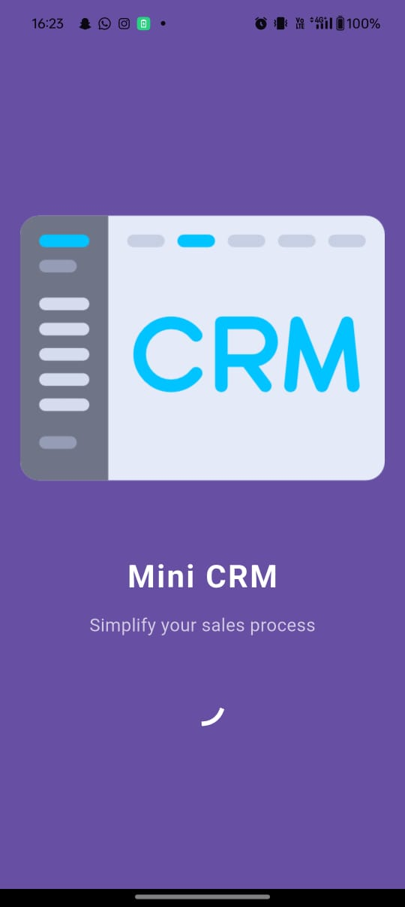
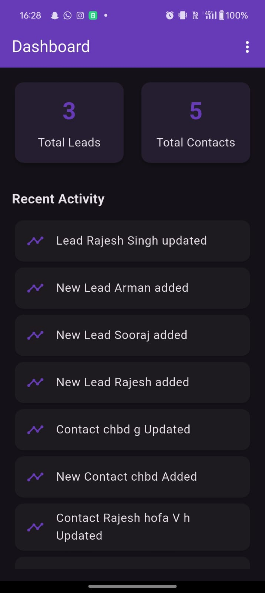

# CRM Flutter project.

# Setup instruction
### Clone the Repository
git clone https://github.com/kashifDev786/Mini_CRM.git

cd your-repo-name
### Install Dependencies
flutter pub get
### Generate Hive Adapters (if using build_runner)
flutter pub run build_runner build --delete-conflicting-outputs
### Run the App
flutter run
### Requirements
Flutter SDK (3.32.1),

Dart SDK,

Android Studio (version 2024.3.2),

Hive and BLoC dependencies configured

# Architecture Summary

I am follow the clean architecture with Layers: Presentation → Business Logic → Data
### Presentation
    In Presentation Layer declare List of screen
### Business logic
    In Business Logic menioned Bloc Files
### Data    
    In Data use model of data 

# ScreenShot
<h3>📸 App Screenshots</h3>
<table>
  <tr>
    <td align="center">
    <strong>Splash Screen</strong>
    </td>
    <td align="center">
    <strong>Login</strong>
    </td>
    <td align="center">
    <strong>Light Mode Dashboard</strong>
    </td>
  </tr>
  <tr>
    <td align="center">
    <strong>Dark Mode Dashboard</strong>
    </td>
    <td align="center">
    <strong>Lead Screen</strong>
    </td>
    <td align="center">
    <strong>Add leads</strong>
    </td>
  </tr>
   <tr>
    <td align="center">
    <strong>Edit Leads</strong>
    </td>
    <td align="center">
    <strong>Contact Screen</strong>
    </td>
    <td align="center">
    <strong>Add Contacts</strong>
    </td>
  </tr>
  <tr>
    <td align="center">
    <strong>Edit Contact</strong>
    </td>
  </tr>
</table>

# Demo credentials
#### Email
test@gmail.com
#### Password
123456
